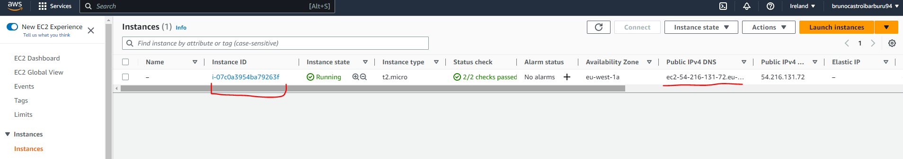
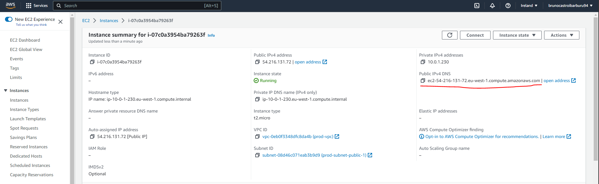
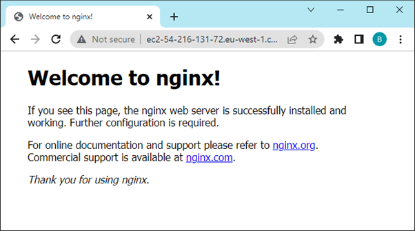

# Example 02: VPN and server creation #


In this example we are going to create a VPN and access it only from our current (public) IP address. This tutorial is inspired in the example provided [by AWS in their official documentation](https://docs.aws.amazon.com/vpc/latest/userguide/vpc-network-acls.html#nacl-examples). This example also takes advantage of the guidance provided by [Ali Atakan Medium article](https://medium.com/@aliatakan/terraform-create-a-vpc-subnets-and-more-6ef43f0bf4c1).<br>

This implementation makes use of Security Group that acts as a firewall filtering the incoming and outgoing traffic from instances within the subnet within the VPC. There's  a second way of doing this (in example 3) that uses ACL's. 

### Pre-requisites ###
**SSH keys:** As part of this example a server in EC2 will be created, and access to it through SSH will be granted from your public IP.  The default key pair will be *demo-e2-key* and demo-e2-key.pub. Which will be stored under **/root/.ssh/**.<br>

You can use the following command to generate the key pair.

```bash
ssh-keygen -f /root/.ssh/demo-e2-key
```

Then you can use the following command to connect via SSH once the server is up:

```bash
# ssh -i {private_key} {user}@{target_ip_address} 
ssh -i /root/.ssh/demo-e2-key ubuntu@ec2-34-243-2-176.eu-west-1.compute.amazonaws.com
```
### Procedure
Refresh your token if needed.
```bash
. refreshEnv.sh
```

Initialize terraform and setup the backend file for this example.
```bash 
make XX=02 tf_init
```
Then proceed to visualize the resources to be created 
```bash 
make XX=02 tf_plan
```
And proceed to create them:
```bash 
make XX=02 tf_apply
```
**Remember to destroy the resources after you finished or you may be charged by AWS.**
```bash 
make XX=02 tf_destroy
```


### Results
As usual after applying the changesm, you should see an additional EC2 instance running.
{#fig:findEC2}

To locate its IP address look among the columns of the figure above or zoom into the properties of the EC2 instance.
{#fig:findEC2}

If you copy the address into your browser you should see the Nginx server running.
{#fig:findEC2}


### Frequent Questions ###

**How do you know your public IP address?**<br>
As you may already know if your internet provider allocates you a dynamic IP address, your public IP address is going to change everytime you turn on and off your PC. Therefore the first thing to address in this document is how to retrieve your public IP address thing you need to do is to know what your. <br>


There are many ways to get your public IP address:<br>

1. From Bash Script: As in this  [StackExchange article](https://unix.stackexchange.com/questions/22615/how-can-i-get-my-external-ip-address-in-a-shell-script), using the **dig** command working with [OpenDNS](https://en.wikipedia.org/wiki/OpenDNS).<br>
```bash
dig +short myip.opendns.com @resolver1.opendns.com
```

2. From using your brower and going to [http://ipv4.icanhazip.com](http://ipv4.icanhazip.com). Note that if you are using a VPN this value may change.

In this example we do not care about the passing it as an input because the IP address is fetched using

```go
data "http" "myip" {
  url = "http://ipv4.icanhazip.com"
}
```
