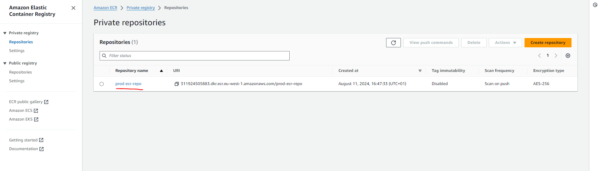
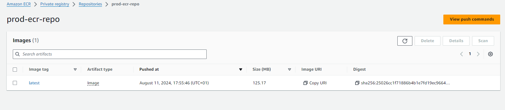

# Example 03: Set up an Elastic Container Repository #
In this example we are going to create an ECR and load it with a docker image, this example is also instrumental to downstream examples relying in containerized applications.

### Pre-requisites ###
- Have Docker CLI in your system
- Have AWS CLI in your system


### Procedure

#### 1 - Build your Infrastructure
Refresh your token if needed.
```bash
. refreshEnv.sh
```

Initialize terraform and setup the backend file for this example.
```bash 
make XX=03 tf_init
```
Then proceed to visualize the resources to be created 
```bash 
make XX=03 tf_plan
```
And proceed to create them:
```bash 
make XX=03 tf_apply
```

#### 2 - Upload (Push) Images to ECR
On a console of your system (not the docker container) build and push your image into ECR.
```bash
# Navigate to the images folder
cd ./aws_terraform/example_03/images

# Build your image
docker build -t hello-world .

# Run your image locally (to check it works)
docker run -t -i -p 80:80 hello-world

# Tag your image: Images tagged with ${AWS_ACCOUNT}.dkr.ecr.${REGION}.amazonaws.com/prod-ecr-repo are the only ones to be uploaded
docker tag hello-world ${AWS_ACCOUNT}.dkr.ecr.${REGION}.amazonaws.com/prod-ecr-repo

docker tag <local_image>:<local_image_tag> <repository_url>:<image_Tag_you_wanna_proivde_in_ECR>

# Link docker to your ECR repository
aws ecr get-login-password --region ${REGION} | docker login --username AWS --password-stdin ${AWS_ACCOUNT}.dkr.ecr.${REGION}.amazonaws.com/prod-ecr-repo


# Push images tagged with ${AWS_ACCOUNT}.dkr.ecr.${REGION}.amazonaws.com/prod-ecr-repo
docker push ${AWS_ACCOUNT}.dkr.ecr.${REGION}.amazonaws.com/prod-ecr-repo

```

#### 3 - Clean up
**Remember to destroy the resources after you finished or you may be charged by AWS.**
```bash 
make XX=03 tf_destroy
```


### Results
Once you execute the terraform apply you should be able to see the new repository. 
{#fig:showECR}

And inside it you should see image inside tagged with the tag "latest"
{#fig:showECRImage}


### Frequent Questions ###

**How do you manage the tags in ECR?**<br> No idea, TODO.