# Example 04: Creating an ECS Service
In this example we will set up a nginx server as a ECS service, this allows us to add a load balancer that if the server CPU and or Memory exceeds a threshold (i.e., 70%) another EC2 instance spins up and the load balancer redirects the requests to the least constrained EC2.
 
### Pre-requisites
- Have Docker CLI in your system
- Set up your S3 backend following [Example 1](/terraform_examples/01_SetUpS3Backend/)
- Set up ECR following [Example 3](/terraform_examples/03_ECR/) <!-- Although is not needed, references to it are made during development and need to be cleaned up -->

### Procedure
#### 1 - Build your Infrastructure
Refresh your token if needed.
```bash
. refreshEnv.sh
```

Initialize terraform and setup the backend file for this example.
```bash 
make XX=04 tf_init
```
Then proceed to visualize the resources to be created 
```bash 
make XX=04 tf_plan
```
And proceed to create them:
```bash 
make XX=04 tf_apply
```
#### 2 - Clean up
**Remember to destroy the resources after you finished or you may be charged by AWS.**
```bash 
make XX=03 tf_destroy
```

#### Results
Now the Nginx shouyld be available through the load balancer, first go to the Load Balancer page to know the its public address.
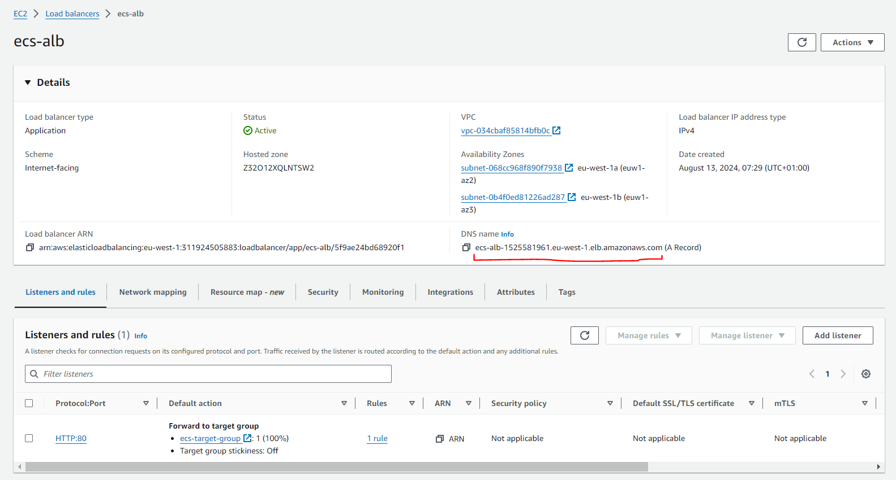{#fig:e04_ALB}

By copying it into the browser now you should be able to see the Nginx server.
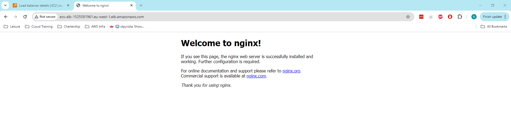{#fig:e04_ALB_Welcome_to_nginx!}

### Known issues

#### 503 responses coming from the ALB address
The services do not automatically deploy in the EC2 instance. If this happens you can get a 503 response from the load balancer like the one below.

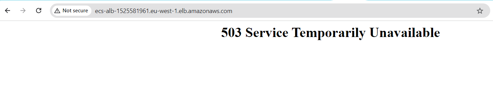{#fig:e04_503}

The attempts to connect through the load balancer can be also observed, in particular the 503 responses when trying to call the address of the Load Balancer can be seen in the console either from cloudwatch or from the Monitoring tab of the load balancer in the console.
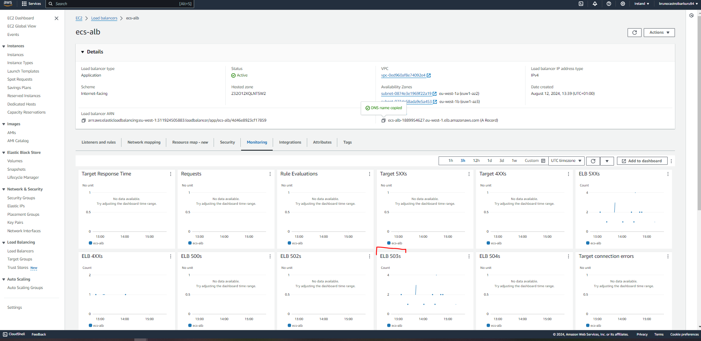{#fig:04_ALB503}

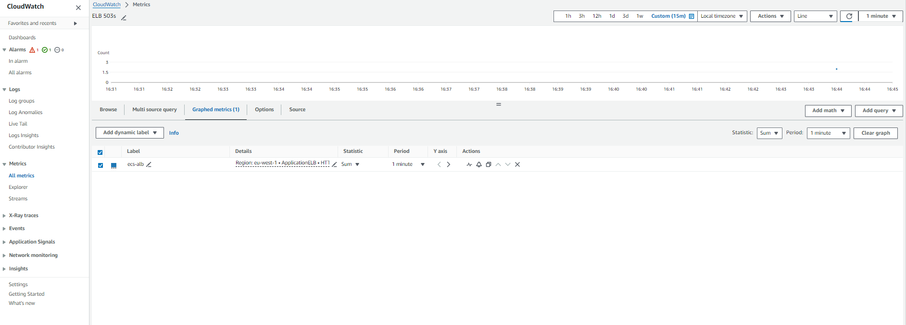{#fig:04_ALB503_CloudWatch}

#### 502 responses coming from the ALB address
If the target is correctly registered for the Load Balancer but the task is not executed (the docker container is not running in the EC2 instance) a 502 error will appear instead.

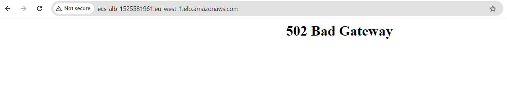{#fig:e04_502}

#### How to make it work
Use the following commands to connect via SSH on any of the EC2 instances created by the ECS capacity provider (in this example I picked the bottom one):

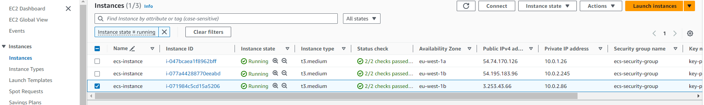{#fig:e04_EC2s}
Make note of its attributes as they are generated for the instance and will be different on each instantiation of this infrastructure:
- **Public IPv4 address:** 3.253.43.66
- **Private IP address:** 10.0.2.86

```bash
# ssh -i {private_key} {user}@{target_ip_address} 
ssh -i /root/.ssh/demo-e2-key ec2-user@ec2-3-253-43-66.eu-west-1.compute.amazonaws.com
```

##### Check docker exists in the EC2 instance
First check that you have docker installed by listing the containers and images in the EC2 instance.
```bash
# List all the containers 
docker ps -a 
# List all the images
docker images -a 
```

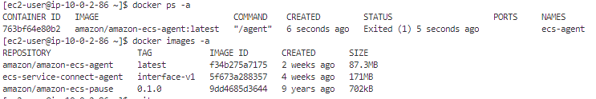{#fig:e04_EC2_initial_docker}

##### Manually pull and run the docker server if its not running
Manually pull and run the nginx server.

```bash
# Pull the image for the nginx server
docker pull nginx:latest

# Run the image (use -d option to run in detached mode,aka in the background)
docker run -p 80:80 nginx
# docker run -d -p 80:80 nginx 
```


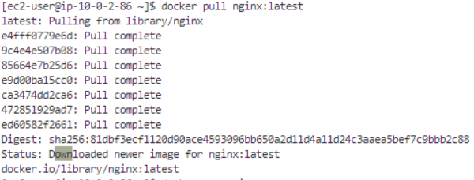{#fig:e04_EC2_docker_pull_nginx}

After running docker run wait for a couple of minutes, Nginx takes some time to start, it will show something similar to the logs below for a couple of minutes before starting to display the logs from incoming connections.

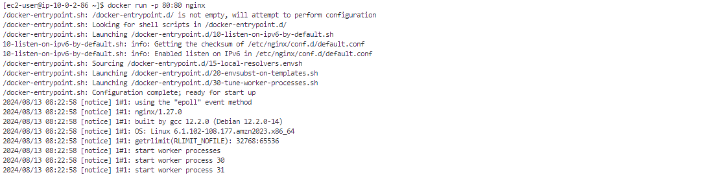{#fig:04_Nginx_start}

Now you should be able to access the Nginx server from the public IP address of the EC2.
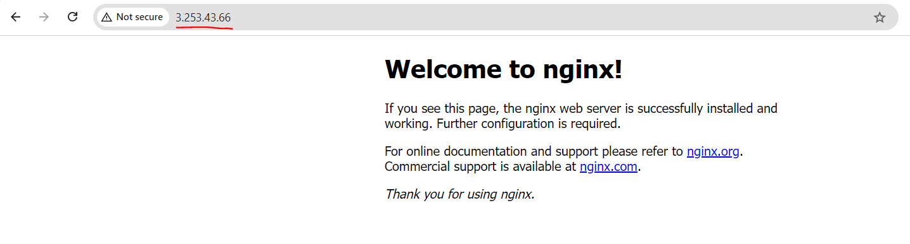{#fig:e04_EC2_Welcome_to_nginx!}

##### Check the EC2 instance role 
Another important step is to give the EC2 instance a role the necessary access to ECR to be able to pull the image, for testing purposes one can assing the `AmazonEC2ContainerRegistryFullAccess` policy to the role. The process to manually create and assign that role is shown below.

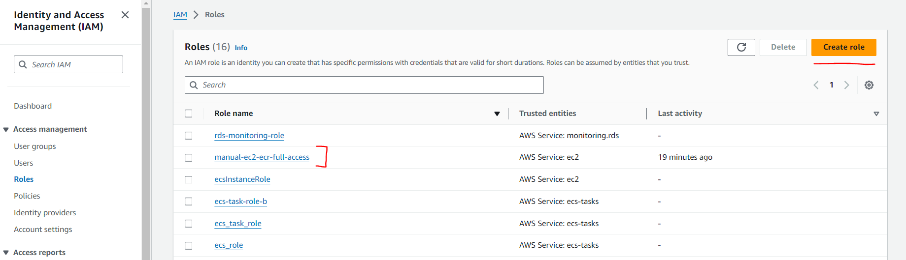{#fig:e04_ec2_full_access_to_ecr}
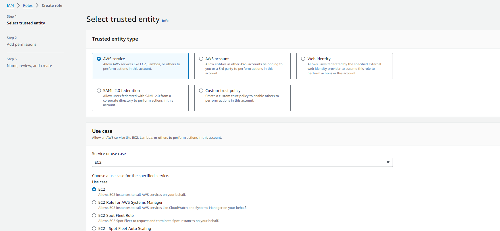{#fig:e04_ec2_full_access_to_ecr_02}
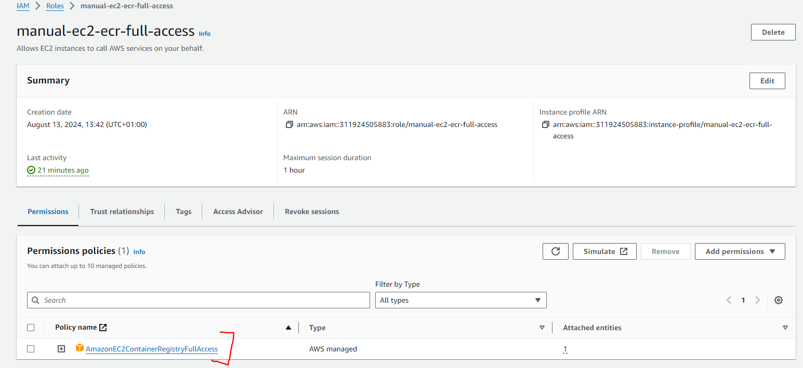{#fig:e04_ec2_full_access_to_ecr_03}
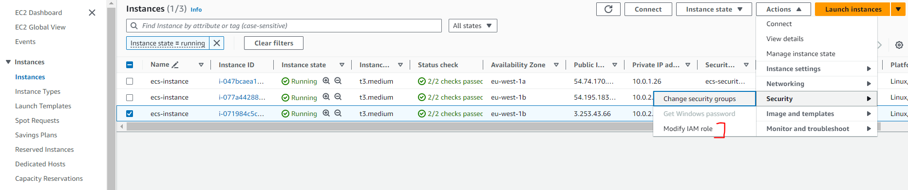{#fig:e04_ec2_full_access_to_ecr_04}
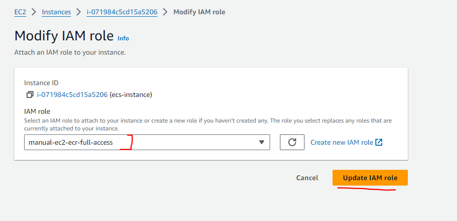{#fig:e04_ec2_full_access_to_ecr_05}

##### Check the registration of EC2 among ALB targets
The next step is to register the EC2 instance into the target of the ALB, you will need to navigate to the `ecs-target-group` and register the private IP address of the instance running Nginx.

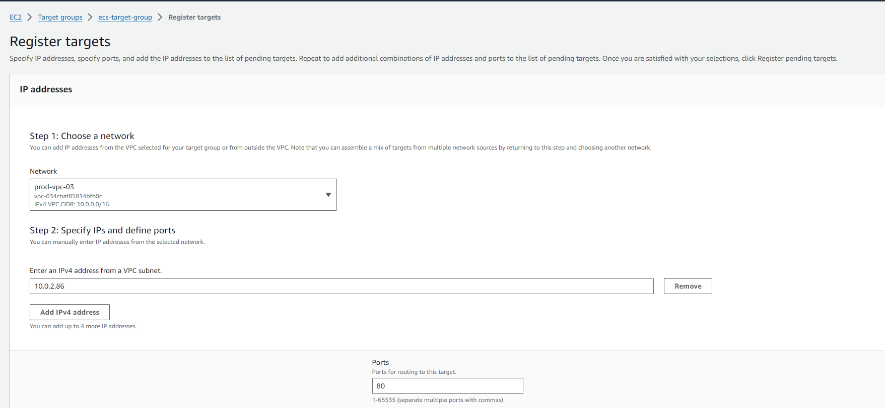{#fig:e04_Manual_Target_Registration}

Now the Nginx should be available through the load balancer.
{#fig:e04_ALB}
{#fig:e04_ALB_Welcome_to_nginx!}