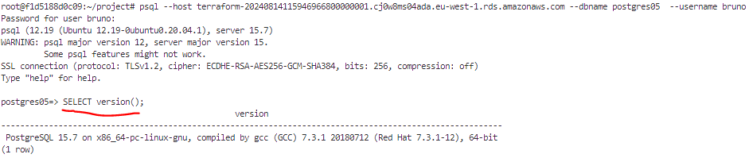
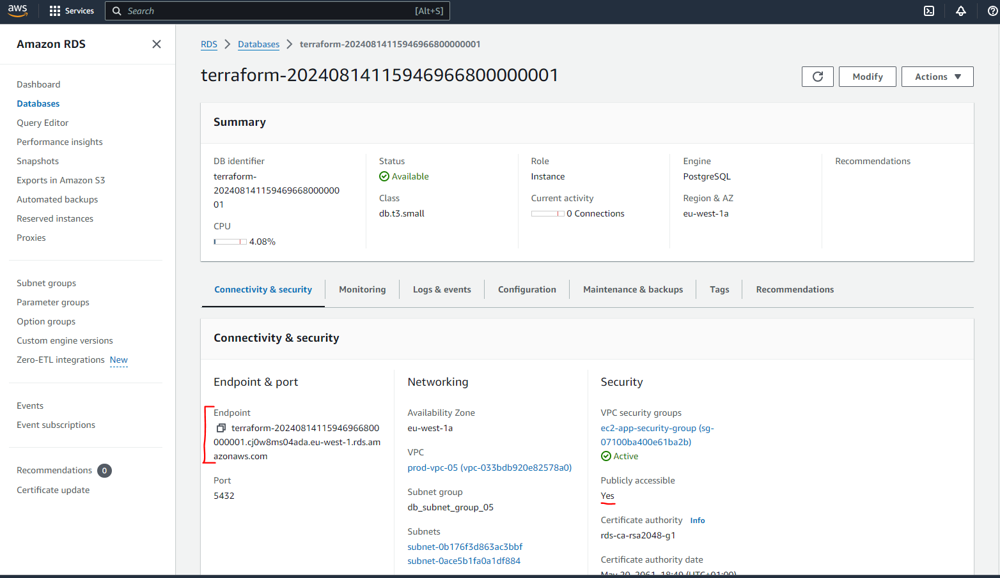

# Example 04: Creating an ECS Service
In this example we will set up a Streamlit App in an EC2 instance. server as a ECS service, this allows us to add a load balancer that if the server CPU and or Memory exceeds a threshold (i.e., 70%) another EC2 instance spins up and the load balancer redirects the requests to the least constrained EC2.
 
### Pre-requisites
- Have Docker CLI in your system
- Set up your S3 backend following [Example 1](/terraform_examples/01_SetUpS3Backend/)
- Set up ECR following [Example 3](/terraform_examples/03_ECR/) 
- Set up ECR following [Example 3](/terraform_examples/03_ECR/) 

### Procedure
#### 1 - Build your Infrastructure
Refresh your token if needed.
```bash
. refreshEnv.sh
```

Initialize terraform and setup the backend file for this example.
```bash 
make XX=05 tf_init
```
Then proceed to visualize the resources to be created 
```bash 
make XX=05 tf_plan
```
And proceed to create them:
```bash 
make XX=05 tf_apply_plan
```

#### 2 - SSH into instance to check if the image has been pulled and the container is running 
```bash
ssh -i /root/.ssh/demo-e2-key ec2-user@ec2-34-244-67-174.eu-west-1.compute.amazonaws.com

|


```
#### 3 - Clean up
**Remember to destroy the resources after you finished or you may be charged by AWS.**
```bash 
make XX=05 tf_destroy
```

## Using RDS

In this example we have set up a Postgres database for the application to interact with, the master password of the database is kept in the AWS Secrets, in order to create a user for the application you will need to fetch the password, log into the database and create the user.

To fetch the secret from your console
```bash
# List all your databases
aws rds describe-db-instances 

# List a particular instance
aws rds describe-db-instances --db-instance-identifier "terraform-20240814115946966800000001" --no-cli-pager
#  --no-paginate --no-cli-pager

# Disable history substitution if you are using GitBash as it doesn't like exclamation marks
set +H

# Fetch your secret from your secret ARN (make note of your username and password)
aws secretsmanager get-secret-value --secret-id "your-secret-arn"

# Connect to the database
psql --host your-endpoint --dbname postgres05  --username your-user 

# The CLI will prompt you for the password

# Once entered you can use SQL to run anything you want
# For example running the code below will tell you which version of PostgreSQL your DB has.
SELECT version();
```

{#fig:rds_cli_connection}
cli_connection.PNG){#fig:rds_endpoint}
